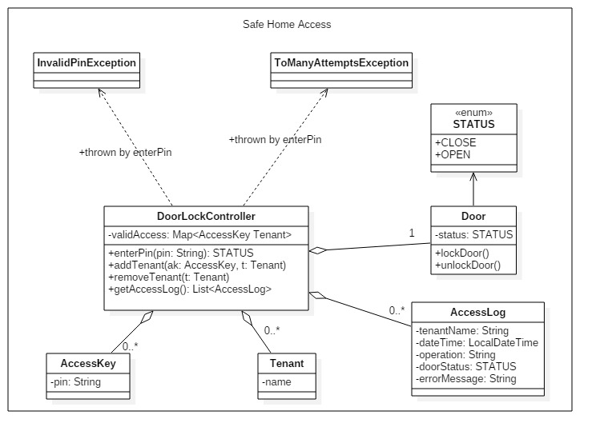

# Implement the following exercises

## Exercise 1 - Safe Home Access

Implement a safe home access Java application based on the diagram above. Consider also following functional requirements in implementing your program:
1. If pin is wrong enterPin method shall throw an _InvalidPinException_ error
2. If 3 consecutive attempts are made to enter pin then door is locked forever and enterPin method shall throw TooManyAttemptsException 
3. If pin is correct door shall be opened or closed depending on current state (if open will be closed, if closed will be opened)
4. All attempts (successful or not) will be logged in access log list